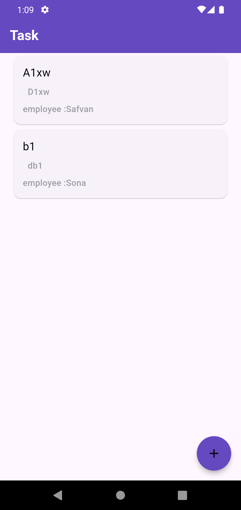
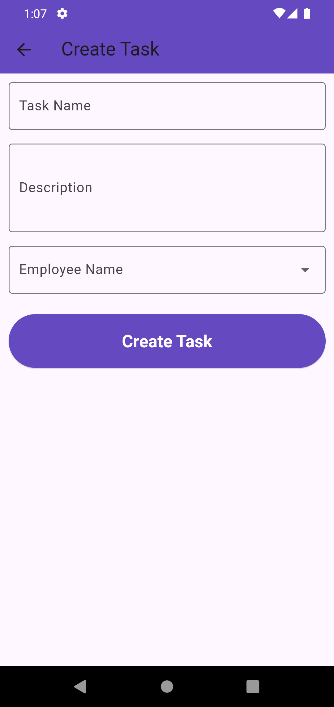
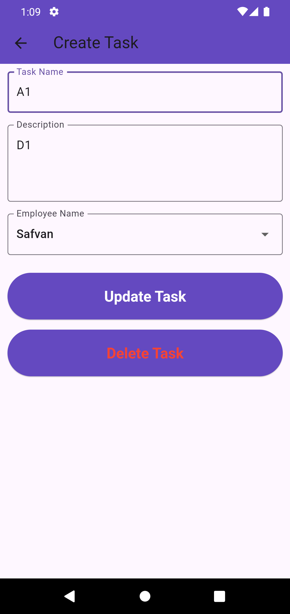
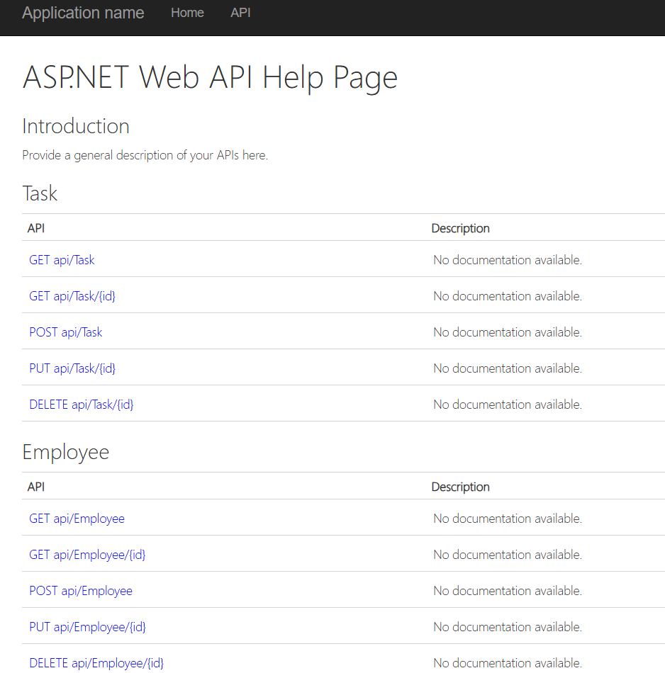

# Task App

Task App is a simple and efficient task management application built using Flutter. It leverages the power of Flutter Bloc for state management, providing a clean architecture and seamless user experience.

## Features

- 🏠 **Home Page**: View and manage your tasks efficiently.
- ➕ **Create Task Page**: Add new tasks to the list.
- 🔄 **State Management**: Powered by `flutter_bloc` for reactive updates and scalable architecture.

## Requirements

- Flutter SDK
- Dart
- A code editor (e.g., VS Code or Android Studio)
- Sql Server (for store data)
- VisualStudio (for asp.net web API)
- IIS (for run the api)
   
## Installation

1. Clone the repository:
   ```bash
   git clone https://github.com/safvanp/Task_App.git
   cd task-app
## File Structure

lib/

├── bloc/               # Contains TaskBloc for state management

├── constants.dart      # Stores application constants

├── repository/         # Contains TaskRepository for managing data

├── screens/            # UI screens (HomePage, CreateTask)

└── main.dart           # Application entry point


## Screenshots

### Home Page


### Create Task Page
   

### Update Task Page


### Web API Help Page


## API Connection

The Task App communicates with a backend API for task management using HTTP requests. Below is an example of how the app connects to the API.

### API Base URL
Set the base URL for your API in a configuration file (e.g., `constants.dart`):

```dart
const String baseUrl = 'http://127.0.0.1:86/';
const getAllTaskEndPoint = 'api/Task';
const getAllEmployeeEndPoint = 'api/Employee';
const addTaskEndPoint = 'api/Task';
const updateTaskEndPoint = 'api/Task/';
const deleteTaskEndPoint = 'api/Task/';

### Endpoints

#### 1. **Get All Tasks**
Fetches the list of all tasks.

- **URL**: `api/Task`
- **Method**: `GET`
- **Response**:
  ```json
  [
     {
       "id": 9,
       "TaskName": "A1xw",
       "TaskDescription": "D1xw",
       "EmployeeName": "Safvan"
     },
     {
       "id": 10,
       "TaskName": "b1",
       "TaskDescription": "db1",
       "EmployeeName": "Sona"
     }
]

#### 2. Create a New Task**
Create new task.

- **URL**: `api/Task`
- **Method**: `POST`
- **Request Body**
### Request Headers
Ensure the following headers are included in your request:

```json
{
  "Content-Type": "application/json"
}
body :
{
        "id": 0,
        "TaskName": "A1",
        "TaskDescription": "D1",
        "EmployeeName": "Safvan"
}

#### 3. Update Task**
Update old task.

- **URL**: `api/Task/1`
- **Method**: `PUT`
- **Request Body**
### Request Headers
Ensure the following headers are included in your request:

```json
{
  "Content-Type": "application/json"
}
body :
{
        "id": 1,
        "TaskName": "A1",
        "TaskDescription": "D1",
        "EmployeeName": "Safvan"
}

#### 4. Delete Task**
Remove old task.

- **URL**: `api/Task/1`
- **Method**: `DELETE`
- **Request Body**
### Request Headers
Ensure the following headers are included in your request:

```json
{
  "Content-Type": "application/json"
}
body :
{
        "id": 1,
        "TaskName": "A1",
        "TaskDescription": "D1",
        "EmployeeName": "Safvan"
}

#### 5. **Get All Employee**
Fetches the list of all employee.

- **URL**: `api/Employee`
- **Method**: `GET`
- **Response**:
  ```json
  [
     {
       "id": 1,
       "name": "Safvan",
       "gender": "M"
     },
     {
       "id": 2,
       "name": "Sajid",
       "gender": "M"
     },
     {
       "id": 3,
       "name": "Sona",
       "gender": "F"
     },
     {
       "id": 4,
       "name": "Safeer",
       "gender": "M"
     },
     {
       "id": 5,
       "name": "Saniya",
       "gender": "F"
     }
]

```
